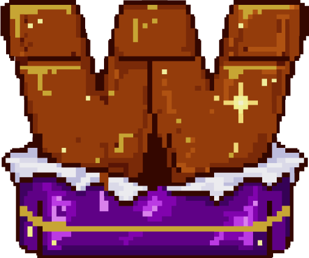

# Wonka's Quest

Wonka's Quest is a 2D platform adventure game built in C with SDL2. The game combines animated character movement, enemy AI, platform navigation, collectibles, menus, sound effects, music, save/load screens, outfit selection, and a minimap into one complete playable project.

This project was developed as a team assignment. Each part of the game was integrated into a shared codebase, with gameplay systems, menus, assets, collisions, and debugging brought together into the final version.



## Game Overview

In Wonka's Quest, the player explores colorful platform levels inspired by the Wonka universe. The objective is to move through the level, collect useful items, survive enemy encounters, and progress while managing health and score.

The game supports both single-player and two-player modes. In multiplayer, the game can use a split-screen view so both players can move independently through the world.

## Features

- 2D side-scrolling platform gameplay
- Single-player and two-player modes
- Split-screen multiplayer camera support
- Player selection and outfit selection menus
- Multiple playable levels
- Animated enemies with state-based behavior
- Enemy movement, jumping, following, attacking, hurt, and death states
- Enemy projectiles and player projectile collision handling
- Health, score, and collectible systems
- Coins, health pickups, and level progression items
- Platform collision and background collision handling
- Minimap display for navigation
- Main menu, options menu, save menu, load menu, history, and high score screens
- Sound effects and background music using SDL_mixer
- Pixel-style visual identity with custom sprites and UI assets

## Team Project

Wonka's Quest was created as a collaborative team project. The final game brings together work across multiple areas:

- Player movement and animation
- Menu interfaces
- Level backgrounds and platforms
- Collision systems
- Minimap system
- Save/load flow
- Audio and visual assets
- Game integration and debugging

## My Contribution

My main contributions to the project were:

- Developing the enemy system in `enemy.c` and `enemy.h`
- Implementing enemy AI states such as waiting, moving, following, attacking, jumping, hurt, and death
- Handling enemy animations, health bars, projectiles, sounds, and collisions


## Tech Stack

- Language: C
- Graphics: SDL2
- Images: SDL2_image
- Audio: SDL2_mixer
- Fonts/Text: SDL2_ttf
- Compiler: GCC
- Build system: Makefile

## Project Structure

```text
.
|-- main.c                  # Main loop, game state, rendering, menus, levels
|-- enemy.c / enemy.h        # Enemy AI, attacks, collisions, health, animations
|-- player.c / player.h      # Player movement, animation, health, score, attacks
|-- background.c / .h        # Level backgrounds and platform loading
|-- minimap.c / .h           # Minimap rendering
|-- collision_bb.c / .h      # Bounding-box collision
|-- collision_perfect.c / .h # Pixel-perfect collision helpers
|-- mainmenu.c / .h          # Main menu
|-- submenu.c / .h           # Options menu
|-- save_menu.c / .h         # Save menu
|-- load_menu.c / .h         # Load menu
|-- outfit_menu.c / .h       # Outfit selection
|-- player_mode.c            # Single-player / multiplayer mode selection
|-- player_selection.c       # Character/player selection
|-- Assets_*                 # Game assets, sprites, UI, audio, backgrounds
|-- assets_*                 # Additional player, menu, outfit, and load assets
|-- makefile                 # Build instructions
```

## Controls

### Player 1

| Action | Key |
| --- | --- |
| Move right | Right Arrow |
| Move left | Left Arrow |
| Jump | Up Arrow |
| Attack | Space |

### Player 2

| Action | Key |
| --- | --- |
| Move right | D |
| Move left | Q |
| Jump | Z |
| Attack | F |

### Menus and Game Shortcuts

| Action | Key |
| --- | --- |
| Confirm / select | Enter or Space |
| Go back / exit menu | Escape |
| Open save menu during gameplay | V |
| Open options during gameplay | B |
| Toggle split-screen mode during gameplay | M |
| Adjust volume in options | + / - |

## Build and Run

### Requirements

Make sure the following are installed:

- GCC
- Make
- SDL2 development libraries
- SDL2_image
- SDL2_mixer
- SDL2_ttf

### How to Run on Linux

```bash
sudo apt install build-essential libsdl2-dev libsdl2-image-dev libsdl2-mixer-dev libsdl2-ttf-dev
make
./wonka
```


## Gameplay Systems

### Enemy AI

The enemy system uses several behavior states:

- `Waiting`: enemy remains idle until the player is close enough
- `Moving`: enemy moves within a controlled range
- `Following`: enemy actively chases the player
- `Attacking`: enemy launches projectiles when close enough
- `Jumping`: enemy jumps to navigate platforms or chase the player

Enemies also support directional animations, health bars, damage reactions, death animations, projectile management, collision with players, collision with platforms, and interaction with level entities.

### Player System

Players can move, jump, attack, collect coins, gain health, take damage, and accumulate score. The game supports one or two players, with different controls for each player.

### Level and Camera System

The game includes multiple levels with scrolling backgrounds, platforms, collectibles, enemies, and camera movement. In two-player mode, the camera can switch to split-screen rendering so each player gets their own view.

### Menus

The game includes a full menu flow:

- Main menu
- Player mode selection
- Player selection
- Outfit selection
- Options menu
- Save menu
- Load menu
- High score screen
- History screen

## Assets

The project includes custom visual and audio assets for:

- Characters
- Enemies
- Health bars
- Weapons/projectiles
- Backgrounds
- Platforms
- Menus
- Buttons
- Music and sound effects
- Fonts

All assets are loaded from the project folders at runtime, so the game should be launched from the project root directory.

## What I Learned

This project strengthened practical skills in:

- Building a complete game loop in C
- Integrating multiple SDL2 libraries
- Managing animation states
- Designing enemy AI behavior
- Handling collisions across players, enemies, projectiles, platforms, and backgrounds
- Coordinating modules in a team codebase
- Debugging complex gameplay interactions
- Keeping asset-heavy projects organized

## Status

The project is a playable academic game prototype with menus, levels, enemies, player systems, audio, collectibles, and core gameplay integration.
